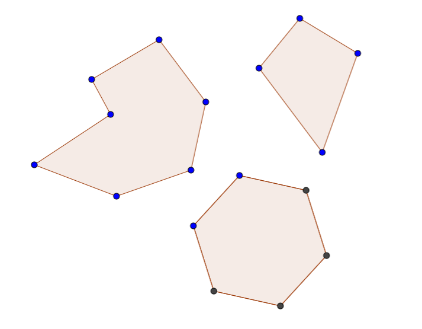
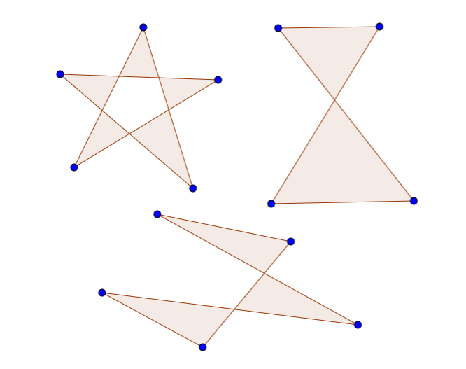
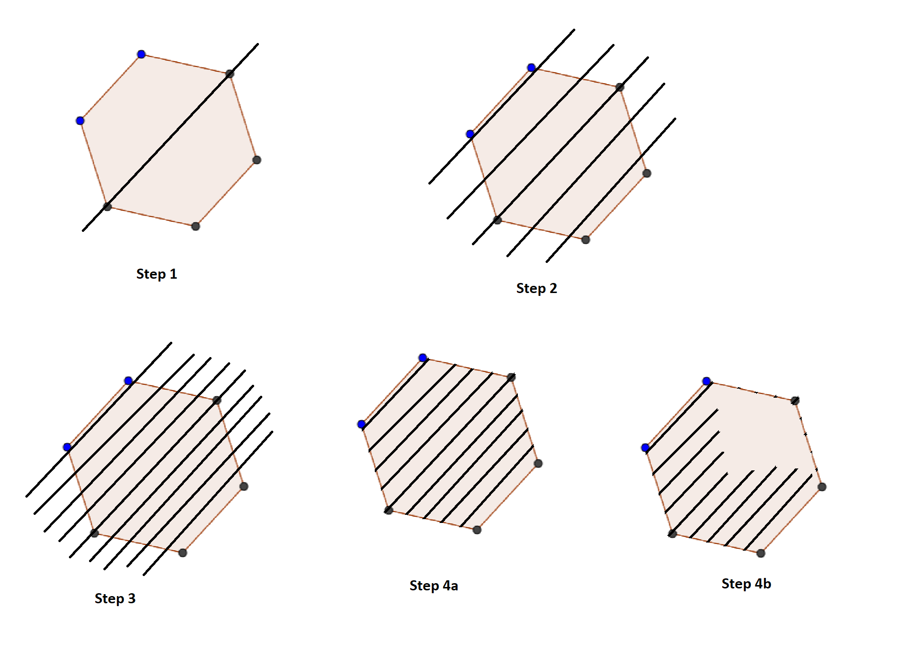
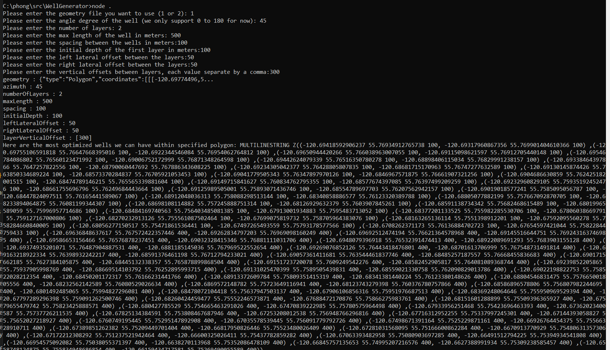

# Wells Generator
A **Node.js** program that will generate a pad of horizontal wells within a specified polygon.

## Introduction
Wells Generator is a program that will generate a pad of horizontal wells within a specified polygon. There is n number of layers of wells gonna be generated according to a specified input. Each subsequent layer will be offset laterally and vertically by a specified amount, similar to a "wine rack". The well-sticks will be positioned according to an azimuth specified in the input. The wells will fill the entire polygon, they won't go beyond the bounds of the polygon as well as won't be longer than the specified max length.

## Inputs:
- geometry: **Geojson file path** - the path to the geojson file.
- azimuth: **angle degree** - the direction of the well.
- numberOfLayers: **integer** - number of layers.
- maxLength: **number** - max length of the well in meters
- spacing: **number** - the spacing between the wells.
- initialDepth: **number** - the initial depth of the first layer in meters
- leftLateralOffset: **number** - the left lateral offset between the layers
- rightLateralOffset: **number** - the right lateral offset between layers
- layerVerticalOffset: **array of number equal to n-1 layers** - the vertical offset between layers For example, if we have a 3 layer pad, an input of [100,200] means that layer 1 -> layer 2 should have a vertical spacing of 100m, layer 2 -> layer 3 will have a vertical spacing of 200m

## Outputs:
The program will output a MultiLineString in WKT (https://en.wikipedia.org/wiki/Well-known_text_representation_of_geometry) containing longitude (x), latitude (y), and depth (z). Eg.

MULTILINESTRING Z((10 10 1, 20 20 3, 10 40 4),(40 40 4, 30 30 1, 40 20 4, 30 10 4))

## Some notes on the application
- [*Limitation*] **geometry** input: Currently, I only allow users selecting 1 or 2, to select between 2 input files in the src. However, the algorithm will work with any polygon data file. The current implementation just simply considers the file selector as out of scope.
- [*Limitation*] **azimuth** input: Currently, I only support the input between 0 - 180. Mainly to reduce testing time, the algorithm is really to expand for 180 - 360 without adding much complexity.
- There is a validation to make sure **spacing** == **leftLateralOffset** + **rightLateralOffset**, this is based on the confirmation I've made the other day.
- Turf library was used extensively on polygon calculating (https://github.com/Turfjs/turf/).
- [*Limitation*] The algorithm was only tested against the simple polygon, I haven't tested the code with a complex polygon, also can't be sure if the algorithm still works with those complex cases.

The algorithm should work well with above polygons.

The algorithm unlikely to work with above polygons.

- I tried to not spend a ton of time on the exercise, as I don't think it will help anyone of us.
- Therefore, there is not a lot of testing, also no unit tests...
- I tried my best to document and commenting my code, let me know if you have questions on any of the code.

## Implementation strategy
- Based on the **azimuth**, determined the first point and draw the first well, of the first layer.
> 0 < azimuth > 90 -> select the bottom left most of the polygon and draw to the right

> 90 < azimuth > 180 -> select the top left most of the polygon and draw  to the right

> 180 < azimuth > 270 -> select the top right most of the polygon and draw to the left

> 270 < azimuth > 360 -> select the bottom right most of the polygon and draw to the left

> I also consider selecting the first point as the center mass of the polygon and drawing to both sides, but I consider this is not the most performance sufficient, as well as the number of wells might not be optimized

- Based on the first well, now draw wells to both sides using **azimuth** and  **spacing**, and stop when the new drawing well won't intersect with the polygon (well outside of polygon).
- Then, we can go to the next level, select the first well of the previous layer (either left most or right most), and then continue to draw wells using **azimuth**,  **leftLateralOffset**, and **rightLateralOffset** until we go beyond the bounds of the polygon.
- Continue until we finish up all layers.
- With every well drawn, the algorithm will make sure the well line intersects with the polygon twice, and then if the well stick is more than **maxLength**, we reduce the well stick length to **maxLength** (I consider this is not optimized solution, we can improve this by finding the first intersection with the polygon, then draw the line up to either maxLength, or the line intersect with the polygon again, whichever qualify first)

The code does not match 100% with the steps, but this will help to visualize the strategy.

## How-to
- Clone the project to your local
- install all required packages
> npm install
- run the project using node.js
> node .
- follow the instruction to provide all required inputs for the application

